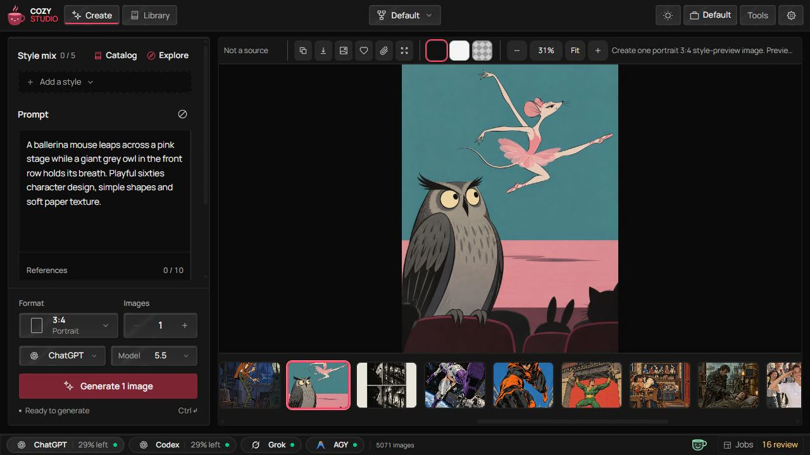
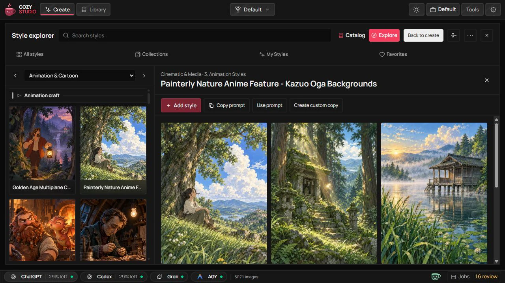
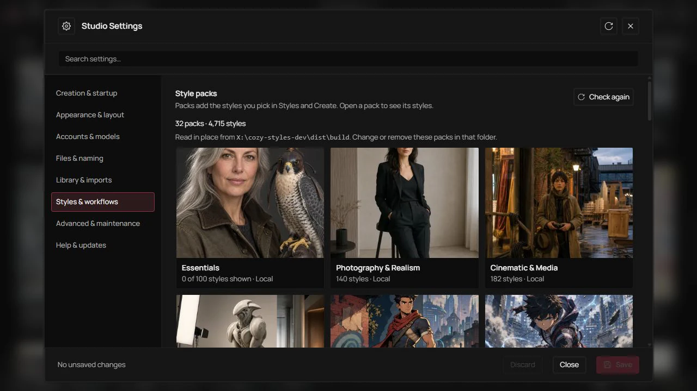
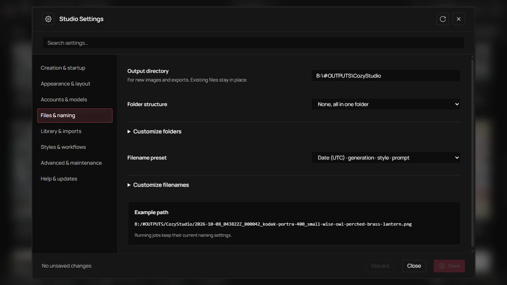

<p align="center">
  
</p>

<p align="center">
  <a href="https://github.com/gvastethecreator/cozy-studio/actions/workflows/ci.yml"></a>
  <a href="https://gvastethecreator.github.io/cozy-studio/"></a>
  <a href="https://bun.com"></a>
  <a href="https://github.com/gvastethecreator/cozy-studio/stargazers"></a>
  <a href="LICENSE"></a>
</p>

**Your ideas, freshly brewed.** Cozy Studio is a free image studio that runs on your own machine. Make images with the subscription you already have (ChatGPT, Grok or Antigravity), pick a style, and keep every result in a folder you can open. No API keys.

[Project site](https://gvastethecreator.github.io/cozy-studio/) · [Source and issues](https://github.com/gvastethecreator/cozy-studio)

<p align="center">
  
</p>

## What you get

- **Styles you can see before you use them.** Style packs hold presets for film stocks, painters, anime studios, pixel art, print processes and more, each with sample cards. Essentials, a curated pack of about 100 styles, installs on first start. Mix up to five styles in one image.
- **Your ChatGPT plan, no API key.** Sign in from Studio Settings and generate with GPT Image models over ChatGPT's own HTTP path. You do not need `OPENAI_API_KEY`, and ordinary jobs do not start `codex app-server`.
- **Files you can find.** Images go to a `Cozy Studio` folder in your Pictures folder, all in one place, named `{timestampUtc}_{generation}_{style}_{prompt}`, for example `2026-10-03_183042Z_000127_kodak-portra-400_retired-lighthouse-keeper-selling-handmade-kites.png`. Sorting by name follows the generation date, time and sequence.
- **Private by default.** The database, thumbnails, logs and sign-in tokens stay in a private app-data folder on your machine. Nothing goes to a hosted library.
- **Workflows beyond a prompt box.** Remaster, Character Lab, Camera View, Cinematic Storyboard, Timeline Frame, Animation Sequence with GIF export, Sprite Sheet and Sprite Atlas.
- **Other providers when you want them.** Codex app-server, Grok Imagine, Google Nano Banana and Antigravity sit behind the same backend.

| Create with a style                                                                                                      | Style explorer                                                                                            |
| ------------------------------------------------------------------------------------------------------------------------ | --------------------------------------------------------------------------------------------------------- |
|  |               |
| **Style packs**                                                                                                          | **Output settings**                                                                                       |
|        |  |

## Quick start

You need:

- Bun on `PATH`. Install it yourself from <https://bun.sh/docs/installation>. Cozy Studio never silent-installs Bun.
- A ChatGPT subscription. You sign in through Studio Settings Sign in. That login is not bundled.
- A modern browser.
- Optional, only for the Codex provider: Codex CLI from <https://github.com/openai/codex> with `codex login`.

**Portable zip.** Double-click `Cozy Studio.bat` on Windows or `Cozy Studio.command` on macOS, then read `PORTABLE.txt`. If `STUDIO_LIBRARY_DIR` is unset, portable start uses `Cozy Studio Library` beside the unpacked folder. Linux is best-effort.

**From a checkout.** Development also requires Node.js 22 (22.18 or newer), 24 (24.11 or newer), or 26+, as required by Vite+.

```bash
bun install
bun run studio:onboard --setup
bun run studio:init
bun run dev
```

Then open the UI at <http://localhost:17222>. The local API health check is at <http://localhost:17223/api/health>.

In **Settings → General**, enable **Notify me about updates** to check `origin/main` at startup and every hour while Studio is visible. You can also check manually. **Update and restart** requires `bun run dev`, a clean `main` checkout with no local commits ahead of the remote, and no queued or running jobs. It fast-forwards to the checked commit, runs `bun install --frozen-lockfile`, restarts the backend and UI, and reconnects the page. If installation fails, Studio blocks new work and keeps the error visible. Retry installs dependencies for the commit already applied, without fetching Git again. **Restart Studio** also works without an update. Save pending settings first. Portable archives and independently launched servers cannot update or restart from Settings.

**Ask an agent.** Ask Codex in this repo to run first setup, or use Copy prompt or Ask Codex on the onboarding screen. The prompt points at `skills/cozy-studio-setup/SKILL.md`.

```text
Set up Cozy Studio for first run.
```

## First run

The onboarding screen checks what is missing, asks before it changes anything, and then checks again. One primary button follows this order:

1. Missing Bun: open the official Bun installer.
2. Missing Codex CLI and no Studio ChatGPT Sign in: open the Codex install docs.
3. Login missing: use Studio Settings Sign in for ChatGPT HTTP. Open a visible `codex login` terminal only for an explicit Codex app-server job.
4. Studio Library or Bootstrap Configuration missing: in-app Setup, or `bun run studio:onboard --setup`.
5. Everything else ready except Codex Product Runtime, and Studio ChatGPT Sign in is not ready: Start app-server.
6. Ready: Open Studio.

Onboarding also shows the images folder, lets you pick another one, and installs the Essentials style pack if no style pack is installed. Ask Codex is an extra path when Codex CLI exists. Copy prompt stays a fallback.

Then:

1. Pick **Styles** in the workflow menu, or stay in **Create** for a plain prompt.
2. Open **Explore**, choose a style, and select **Use 1 selected**.
3. Describe the image and select **Generate**.
4. Find the result in **Library** and in your images folder.

## Where your files go

Cozy Studio keeps its own data apart from your images.

| What                                                                                   | Where                                                                                                                                                                              |
| -------------------------------------------------------------------------------------- | ---------------------------------------------------------------------------------------------------------------------------------------------------------------------------------- |
| Studio Library: SQLite, settings, references, thumbnails, temporary files, logs, trash | `Library` inside the private app-data folder: `%LOCALAPPDATA%\Cozy Studio` on Windows, `~/Library/Application Support/Cozy Studio` on macOS, `~/.local/share/cozy-studio` on Linux |
| Installed style packs                                                                  | `Extensions` in the same app-data folder                                                                                                                                           |
| Sign-in tokens for ChatGPT, xAI and Google                                             | The current user's private app-data folder, never in SQLite                                                                                                                        |
| Generated images                                                                       | `Cozy Studio` in your Pictures folder, or the folder you choose in onboarding or Settings, Output                                                                                  |

Settings, Output can add subfolders and change the file name. File name tokens are `{date}`, `{time}`, `{timestamp}`, `{timestampUtc}`, `{generation}`, `{style}`, `{prompt}`, `{workspace}`, `{workflow}`, `{provider}`, `{model}`, `{job}`, `{jobId}` and `{recipe}`. `{generation}` is a continuous number with at least six digits, assigned when a job is queued and preserved on retry. It continues across days and restarts; cancelled jobs can leave gaps. The default `{timestampUtc}` uses the captured job creation time in UTC, marked with `Z`, so clock and time zone changes do not reorder files. Custom `{date}`, `{time}` and `{timestamp}` tokens keep local time. `{prompt}` keeps the first meaningful words of your prompt; `{style}` keeps the style name, or the names of a style mix joined with `+`. Empty tokens drop their separator. Folder levels can use workspace, date, workflow, provider, model and recipe. The previous default template upgrades automatically; custom templates and running jobs keep their captured choices. Existing files stay in place and remain in the catalog. Downloads and ZIP exports preserve their file names, adding a numeric suffix for duplicate ZIP names. Registered roots, safe Windows names and numeric suffixes prevent path escape and overwriting existing outputs. The Library opens with the newest images first unless its URL selects another order.

New PNG, JPEG and WebP results automatically carry the compiled generation prompt and known image model inside the image, together with the recipe, output settings and generation date. Codex app-server does not report its internal image model, so that field is `unknown`. Studio writes metadata without recompressing the image; original downloads and ZIP exports keep it. Sharing the original file also shares this prompt. Existing images are not rewritten automatically. A manual metadata rewrite reconstructs the prompt from the saved job using the current provider compiler.

**Convert or compress images.** Use the image action in the Library, image viewer or recipe result, or select several Library images and choose Convert selected. Choose JPG, WebP or PNG; JPG and lossy WebP expose a quality slider, WebP also offers lossless encoding, and PNG exposes lossless compression levels. JPG fills transparent areas with the chosen background color. Keep metadata enabled to retain the embedded prompt, model and EXIF, or turn it off to remove descriptive metadata. Color profiles remain to preserve appearance. Use PNG to preserve 16-bit images; lossless WebP accepts 8-bit sources. Save copies in the current output directory and Library, or prepare a download (ZIP for several images). Originals stay unchanged. The result shows actual file sizes; conversion does not guarantee a smaller file. Failed items can be retried without repeating completed items. Animated images are not supported by these controls.

Studio detects the Pictures folder configured by your OS: the Windows Known Folder (including redirected locations), `~/Pictures` on macOS, and `XDG_PICTURES_DIR` from the environment or `user-dirs.dirs` on Linux. Onboarding shows the actual images destination. Linux uses `~/Pictures` when no user directory is configured; if Pictures is disabled in XDG, choose an explicit `STUDIO_IMAGES_DIR`.

To choose another library folder, set an absolute `STUDIO_LIBRARY_DIR` in `.env.local`. `STUDIO_IMAGES_DIR` sets the default images folder for a new library. Paths must be absolute for the OS running the server. An existing images destination or `STUDIO_LIBRARY_DIR` is kept, and the app does not auto-migrate an older library. Changing the images destination in Settings affects new jobs; it does not move existing files.

```env
# Windows
STUDIO_LIBRARY_DIR=D:\Cozy Studio Library

# macOS
STUDIO_LIBRARY_DIR=/Users/<your-user>/Cozy Studio Library

# Linux
STUDIO_LIBRARY_DIR=/home/<your-user>/Cozy Studio Library
```

Preferred Output Path in Settings is an External Output Source scan hint, not the generate destination.

## Style packs

Studio loads styles only from installed style packs (ADR 0011). Settings, Extensions shows each pack's cover and sample cards before you install it, and it installs and updates packs published on GitHub. The default source is `gvastethecreator/cozy-styles`; add more with `STUDIO_EXTENSION_REMOTE_SOURCES=owner/repo,owner/repo`. For a private repository, set `COZY_STYLES_GITHUB_TOKEN` in `.env.local`. To use packs built on this machine, point `STUDIO_EXTENSION_SOURCES` at their folder, such as `../cozy-styles-dev/dist/build`.

Essentials copies its styles from the full packs. When you install a full pack, Studio hides the matching Essentials copies so a style never shows twice.

## Providers

Use the provider control at the bottom of the window to choose the provider for the next image job. It shows readiness, and the choice is saved in Studio Settings. A connected session confirms authentication, not available quota.

**ChatGPT (recommended).** Studio Settings Sign in plus direct subscription HTTP, with GPT Image 2.5 Flare, GPT Image 2.5 Sunburst, or GPT Image 2 when available. Usage and models are read over the same HTTP path. These jobs do not create Codex turns, so they do not spend the Codex app-server usage bucket. They can still reach the ChatGPT HTTP usage limit. This path is not a second subscription and not API credits.

**Codex.** Uses local `codex app-server` and your `codex login`. Choose it only when you want that route. If the Codex path or app-server support is unclear, run `bun run runtime:doctor`. Do not set `STUDIO_CODEX_CLI_PATH` to a `node_modules/.../vendor` binary; use a supported launcher such as the desktop binary or `codex.cmd`.

**Grok Imagine.**

1. Sign in with xAI from Studio Settings, or install Grok Build and run `grok login`.
2. `XAI_API_KEY` in `.env.local` also works on the same HTTP path.
3. Make sure that `bun run providers:preflight -- --provider=grok` reports `canAttempt=true`.

**Google Nano Banana.**

1. Set `GOOGLE_API_KEY` or `GEMINI_API_KEY` to a restricted Gemini key; or enable the Generative Language API, create a Desktop app OAuth client, and set `GOOGLE_OAUTH_CLIENT_ID` plus `GOOGLE_CLOUD_PROJECT_ID`.
2. For OAuth, add your account to the consent-screen test users when the app is still in testing, then connect Google from Studio Settings. `GOOGLE_OAUTH_CLIENT_SECRET` is optional.
3. Confirm that `bun run providers:preflight -- --provider=google` reports `canAttempt=true`.

Direct requests use the Interactions API and current Nano Banana models. An API key takes priority over OAuth. OAuth requests charge quota to `GOOGLE_CLOUD_PROJECT_ID`. Studio requests `store: false`, but Google's service terms and account controls still apply.

**Nano Banana through Antigravity.**

1. Install the official `agy` CLI, open it interactively once, and complete its Google authentication.
2. Run `agy models`, then confirm that `bun run providers:preflight -- --provider=antigravity` reports `canAttempt=true`.
3. Select Antigravity in Studio. Its model setting chooses an Antigravity reasoning model; Nano Banana runs behind the CLI as the `generate_image` tool.

Studio never reads or copies Antigravity credentials. It runs one sandboxed headless conversation in a temporary workspace, imports one validated image, and leaves Antigravity's own artifact history in place. Grok Build keeps its CLI login under `GROK_HOME`.

Provider API keys stay in backend environment variables. Do not put Provider Secrets in SQLite, logs, screenshots, docs, or committed files.

## Workflows and preferences

The workflow picker, Recipes, Settings, and Help share five groups: Create & Edit, Character, Camera & Story, Animation, and Game Assets. Timeline Frame prepares neighboring storyboard frames; Animation Sequence owns frame sequences and GIF export. Character views share the source character within a workspace and keep separate action, prompt, appearance, format, and background drafts. Styles also holds the Medieval and TCG visual catalogs; the TCG finishes, layouts and crossover recipes open in Component Studio, which exports a digital PNG composition and does not certify a physical print process.

Settings starts in General. Choose a preferred workflow for startup and for new workspaces. Direct workflow links take priority. Save applies the draft; Discard restores saved settings, including the theme, accent, and motion preview. Search opens the matching section and focuses its control. Help contains the Cozy guide.

Every workflow offers Maintain background or Remove background. Maintain keeps the source background for image-guided work, while explicit prompt or action changes take priority. With text only, it follows the requested scene and uses workflow defaults only when unspecified. Remove requests native transparent PNG and suppresses automatic backdrops. Native alpha uses the ChatGPT HTTP provider and GPT Image models; Flare and Sunburst support transparent output, and GPT Image 2 support is in preview. See the [OpenAI image prompting guide](https://developers.openai.com/api/docs/guides/image-prompting). Provider rejection remains an error. Studio keeps opaque results and reports an alpha warning instead of applying a hidden cutout.

PNG keeps full alpha. Animation Sequence export can preserve alpha or apply an explicit solid fill. GIF uses binary alpha at 128 and clears each frame to avoid trails. A checkerboard is a preview aid, never part of the saved image.

## Jobs and workers

Run `bun run studio:init` to create local defaults and apply pending SQLite migrations. The command is safe to run again and does not replace an existing Studio Library. For manual setup, copy `.env.example` to `.env.local`.

Worker capacity is set on the host and takes effect after a server restart. `STUDIO_MAX_CONCURRENT_JOBS` is the global ceiling (default 4, range 1–16). Each `STUDIO_MAX_CONCURRENT_<PROVIDER>_JOBS` value limits that provider (default 1, no higher than the global ceiling). Invalid limits stop startup.

Jobs separates Active, Review, and History, with a workspace filter for each view. Active holds only queued and running jobs; jobs needing review stay in Review and do not appear as loading images in the gallery. Batch progress and retry are available within each job, and Worker details shows active slots and provider limits. Queued jobs show why they wait. Providers take turns; jobs within one provider keep their arrival order.

## Useful commands

```bash
bun run dev
bun run runtime:doctor
bun run providers:preflight
bun run studio:onboard
bun run studio:init
bun run check
bun run test
bun run build
bun run validate:fast
bun run validate
bun run validate:release
```

In VS Code, use **Terminal → Run Task**. Daily tasks are Dev, Test, Check, Format and Build. Provider status, Runtime, Styles, Docs and Logs follow them. Each task runs the same Bun script shown above.

Maintenance:

```bash
bun run storage:audit
bun run storage:compact
bun run storage:thumbnails:backfill
bun run tooling:logs:prune
```

## Documentation

- [Agent tools (MCP)](./docs/agents/mcp.md)
- [Agent rules](./AGENTS.md)
- [Architecture](./docs/ARCHITECTURE.md)
- [Dependencies](./docs/DEPENDENCIES.md)
- [Troubleshooting](./docs/TROUBLESHOOTING.md)
- [Portable launch](./PORTABLE.txt)
- [Electron development shell](./docs/ELECTRON.md)
- [Contributing](./CONTRIBUTING.md)
- [Security](./SECURITY.md)

## Status

Cozy Studio is in open-source preview.

- Local development is documented and works.
- ChatGPT HTTP is the recommended provider; Codex app-server is a separate, optional route.
- Style packs install from GitHub releases; Essentials is the default pack.
- Optional provider adapters are backend integrations, not the product center.
- Native video is a later media-domain decision.
- Desktop packaging is not the user channel. Electron is a development shell. Use the browser plus portable launchers, or `bun run dev` in a checkout.

For feature requests, open an issue or a pull request. If this project is useful, star it or become a sponsor.

---

<h4 align="right">Support the further development of this tool 🤍</h4>
<p align="right">
  <a href="https://github.com/sponsors/gvastethecreator/"></a>
  <a href="https://ko-fi.com/gvaste"></a>
  <a href="https://x.com/gvastebb"></a>
</p>
