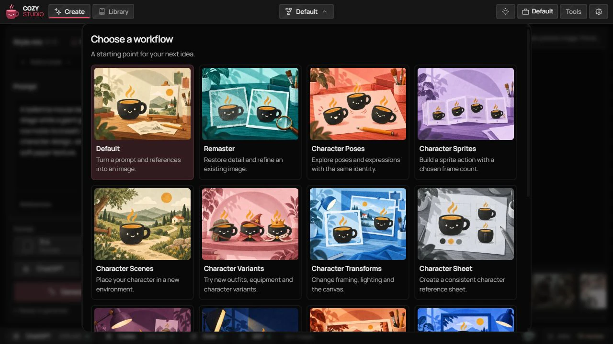
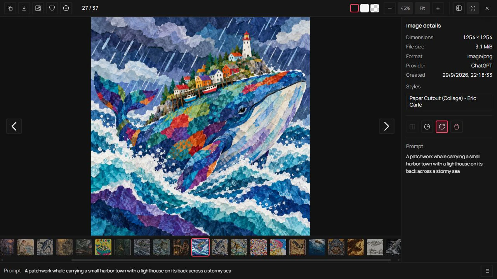

<p align="center">
  
</p>

<p align="center">
  <a href="https://github.com/gvastethecreator/cozy-studio/actions/workflows/ci.yml"></a>
  <a href="https://gvastethecreator.github.io/cozy-studio/"></a>
  <a href="https://bun.com"></a>
  <a href="https://github.com/gvastethecreator/cozy-studio/stargazers"></a>
  <a href="LICENSE"></a>
</p>

**Your ideas, freshly brewed.** Cozy Studio is a free image studio that runs on your own machine. Make images with the subscription you already have (ChatGPT, Grok or Antigravity), pick a style, and keep every result in a folder you can open. No API key is needed for the ChatGPT connection.

[Project site](https://gvastethecreator.github.io/cozy-studio/) · [Source and issues](https://github.com/gvastethecreator/cozy-studio)

<p align="center">
  
</p>

## What you get

- **Styles you can see before you use them.** Style packs hold presets for film stocks, painters, anime studios, pixel art, print processes and more, each with sample cards. Essentials, a curated pack of about 100 styles, installs on first start. Mix up to five styles in one image.
- **Your ChatGPT plan, no API key.** Sign in from Studio Settings and generate with GPT Image models over ChatGPT's own HTTP path. You do not need `OPENAI_API_KEY`, and ordinary jobs do not start `codex app-server`.
- **Files you can find.** Images go to a `Cozy Studio` folder in your Pictures folder, all in one place, named `{timestampUtc}_{generation}_{style}_{prompt}`, for example `2026-10-03_183042Z_000127_kodak-portra-400_retired-lighthouse-keeper-selling-handmade-kites.png`. Sorting by name follows the generation date, time and sequence.
- **Private by default.** The database, thumbnails, logs and sign-in tokens stay in a private app-data folder on your machine. Nothing goes to a hosted library.
- **Workflows beyond a prompt box.** Remaster, Character Lab, Camera View, Cinematic Storyboard, Timeline Frame, Animation Sequence with GIF export, Sprite Sheet and Sprite Atlas.
- **Other providers when you want them.** Codex app-server, Grok Imagine, Google Nano Banana and Antigravity sit behind the same backend.

| Create                                                                                                                          | Style explorer                                                                                                               |
| ------------------------------------------------------------------------------------------------------------------------------- | ---------------------------------------------------------------------------------------------------------------------------- |
|   |      |
| **Style packs**                                                                                                                 | **Files and naming**                                                                                                         |
|                   |     |
| **Workflow picker**                                                                                                             | **Image viewer**                                                                                                             |
|  |  |

Screenshots show the desktop interface on October 8, 2026. Installed packs and results depend on your local library.

## Quick start

You need:

- Bun on `PATH`. Install it yourself from <https://bun.sh/docs/installation>. Cozy Studio never silent-installs Bun.
- A supported provider account for real image jobs. ChatGPT is recommended; sign in through Settings → Accounts & models. That login is not bundled.
- A modern browser.
- Optional, only for the Codex provider: Codex CLI from <https://github.com/openai/codex> with `codex login`.

**Portable launch.** Open `scripts/Cozy Studio.bat` on Windows or `scripts/Cozy Studio.command` on macOS. On Linux, run `bash "scripts/Cozy Studio.command"`. Read [PORTABLE.txt](PORTABLE.txt) for prerequisites. With no explicit `STUDIO_LIBRARY_DIR`, these launchers keep the Library inside the app folder. [Platform support](docs/PLATFORMS.md) lists path rules and verification limits.

**From a checkout.** Development also requires Node.js 22 (22.18 or newer), 24 (24.11 or newer), or 26+, as required by Vite+.

```bash
bun install
bun run studio:onboard --setup
bun run studio:init
bun run dev
```

Then open the UI at <http://localhost:17222>. The local API health check is at <http://localhost:17223/api/health>.

**Ask an agent.** Ask Codex in this repo to run first setup, or use Copy prompt or Ask Codex on the onboarding screen. The prompt points at `skills/cozy-studio-setup/SKILL.md`.

```text
Set up Cozy Studio for first run.
```

## First image

1. Sign in with ChatGPT from the welcome screen or **Settings → Accounts & models**. Codex CLI is not required for this connection.
2. Open **Create** and choose **Default** in the workflow picker.
3. Write a prompt. Optionally add a reference or open the style catalog and choose up to five styles.
4. Check the provider and model in the Create footer, then select **Generate**.
5. Find the result in **Library** and in your images folder. Open the viewer to inspect the image, reuse its prompt or download it.

Onboarding shows the images destination and any setup actions still needed. Setup details stay collapsed when Studio is ready. Essentials installs when no style pack is present. Use the [setup skill](skills/cozy-studio-setup/SKILL.md) with an agent if setup is blocked.

## Files, settings and providers

Images go to **Pictures/Cozy Studio** by default. Change the destination in **Settings → Files & naming**; existing images stay where they are. Studio keeps its database, references, thumbnails and logs in a separate local Library. Portable launch uses its own Library location unless configured otherwise.

Original PNG, JPEG and WebP outputs can contain the generation prompt and model as metadata. Sharing an original file also shares that text. Use the conversion controls with metadata disabled when you want to remove descriptive metadata.

The [user guide](docs/USER_GUIDE.md) covers file locations and naming, conversion, style packs, provider setup, backgrounds, jobs and updates. [Troubleshooting](docs/TROUBLESHOOTING.md) explains blocked jobs and recovery. Contributors should use the [development guide](docs/DEV_GUIDE.md) and [Tooling](docs/TOOLING.md) for commands and validation.

## Documentation

- [Documentation index](./docs/README.md)
- [User guide](./docs/USER_GUIDE.md)
- [Agent tools (MCP)](./docs/agents/mcp.md)
- [Agent rules](./AGENTS.md)
- [Architecture](./docs/ARCHITECTURE.md)
- [Dependencies](./docs/DEPENDENCIES.md)
- [Troubleshooting](./docs/TROUBLESHOOTING.md)
- [Portable launch](./PORTABLE.txt)
- [Electron development shell](./docs/ELECTRON.md)
- [Contributing](./CONTRIBUTING.md)
- [Security](./SECURITY.md)

## Status

Cozy Studio is in open-source preview.

- Local development is documented and works.
- ChatGPT HTTP is the recommended provider; Codex app-server is a separate, optional route.
- Style packs install from GitHub releases; Essentials is the default pack.
- Optional provider adapters are backend integrations, not the product center.
- Native video is a later media-domain decision.
- Desktop packaging is not the user channel. Electron is a development shell. Use the browser plus portable launchers, or `bun run dev` in a checkout.

For feature requests, open an issue or a pull request. If this project is useful, star it or become a sponsor.

---

<h4 align="right">Support the further development of this tool 🤍</h4>
<p align="right">
  <a href="https://github.com/sponsors/gvastethecreator/"></a>
  <a href="https://ko-fi.com/gvaste"></a>
  <a href="https://x.com/gvastebb"></a>
</p>
