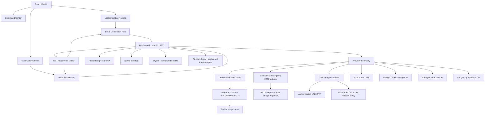

# Architecture

Cozy Studio is a local-first image studio. The React/Vite UI is the main product surface. A local Bun/Hono backend persists state in SQLite, serves managed assets and emits live SSE events. Provider adapters own execution; only the optional Codex route uses `codex app-server`.

## Product shape

- **Provider execution:** Codex uses local `codex app-server`; ChatGPT uses its existing subscription HTTP endpoint, credential store and SSE image executor without creating Codex threads.
- **Local-first:** SQLite state, references, transcripts, thumbnails and logs live in the Studio Library. Generated images use the managed output destination captured at intake, which can be outside that Library. User data stays outside the repo.
- **Library-backed:** the repo contains source code and public assets. Generated user data belongs in the Studio Library.
- **Provider-aware:** supported built-in providers run behind backend adapters. They do not change the product center.
- **Catalog-first:** durable and UI image truth is the Image Catalog. The former workspace snapshot shape is produced only on explicit export.

## Core frontend seams

- `hooks/useStudioShell.ts` composes navigation, runtime, overlays, page state, catalog state, and generation state into the shell.
- `hooks/useGenerationQueueController.ts`, `hooks/useCatalogModalDetailHydration.ts`, and `hooks/useStudioReset.ts` own the cross-domain Queue, modal hydration, and reset policies. The shell only supplies their adapters.
- `hooks/useStudioRuntime.ts` aggregates backend health, onboarding, diagnostics, session verification, and readiness.
  Status shows configured providers only. ChatGPT and Codex usage come from their respective sessions; absent Codex app-server usage is not replaced with ChatGPT usage.
- `hooks/useLocalStudioSync.ts` mirrors jobs, logs, catalog changes, and SSE state.
- `hooks/useCatalog.ts` owns Image Catalog reads, pagination, mutations, trash, queue-result previews, and refresh scopes. The image viewer loads the original asset URL for zoom; reduced variants stay in the grid and thumbnail navigation. An unavailable original produces an error instead of a reduced substitute.
- `lib/imagePanZoom.ts` measures the original raster and viewport. Fit follows viewport changes; manual zoom and pan survive panel toggles and resizing. 100% maps one image pixel to one CSS pixel in both Create and Library. The fullscreen viewer has one compact action bar, a bounded thumbnail strip, a collapsible details panel with style badges, and a fixed-height prompt bar.
- `hooks/useImagePresentation.ts` keeps the current original and its metadata visible until the next original is decoded, then fades the new image in over the previous image. The old layer stays until the opacity transition ends. New requests cancel older loads; workspace changes clear the previous presentation immediately. Canvas controls stay mounted across image changes.
- `TooltipBubble` owns the shared 300 ms reveal delay and short shape/position transition for both explicit and delegated tooltips. Hover actions reveal within their existing card bounds; static cards and controls do not move. Motion follows the system and Studio reduced-motion preference.
- Each surface has one entry owner: native route transitions, CSS panel transitions, or GSAP. GSAP surfaces exclude CSS opacity and geometry transitions; interrupted tweens continue from their visible state. Presence retains closing surfaces for the 120 ms CSS exit. Catalog expansion and collection cards do not replay entry animations inside an already visible panel.
- Thumbnail drags carry only a Catalog Entry ID. The prompt resolves it through the catalog API before attaching a source.
- Library card menus use the shared portaled dropdown so card motion cannot clip their actions. The menu and quick action send the original image to Create through the existing reference attachment flow.
- `hooks/useLibraryUrlState.ts` owns the typed Library query parameters through nuqs 2.10.1 and the React SPA adapter in `main.tsx`. Search, favorites, and sort update the URL with `replace`; workspace selection uses `push`. Updates preserve unrelated parameters and the hash routes. Default filters are omitted; the effective workspace is always included.
- `WorkspaceContext` resolves the URL workspace only after the durable workspace list loads. A missing selection uses the saved preference, an unknown ID becomes `default`, and failed hydration leaves the URL intact for retry. The initial Library link intent is captured before normalization so that a shared Library link takes priority over the preferred startup workflow. A plain startup keeps the existing workflow behavior.
- `lib/catalogRequestGate.ts` gives Catalog replacement, pagination, filter, and detail reads generation-scoped ownership. Stale responses cannot publish across view generations.
- `services/studio-api/http.ts` owns the shared typed HTTP and error boundary. Sibling modules split requests by domain: jobs, catalog, workspaces, runtime, settings, providers, recipes, output sources, maintenance, and logs.
- `services/studioEventSource.ts` owns the shared SSE connection.
- `services/localGenerationRun.ts` submits an atomic Persistent Job batch, observes accepted members, and returns catalog-derived results with complete or partial status.
- `lib/studioCatalogView.ts` and `lib/studioCatalogImageAdapter.ts` materialize UI images from Catalog Entries.
  The view owns batch grouping IDs; the adapter uses that rule when materializing images.
  `lib/recipeIds.ts` owns recipe identity validation; shell metadata only adds titles and recipe-id recovery from legacy Recipe Context text.
- `lib/studioLegacyWorkspaceSnapshotExport.ts` derives the export-only legacy workspace JSON shape from Catalog Entries. There is no browser batch store, import, or recovery path.
- `lib/catalogRenderBudget.ts`, `lib/catalogCardActionSurface.ts`, and `lib/imageGridPresentation.ts` keep hot Catalog rendering bounded.
  They preserve card animation, hover or focus commands, and initial-viewport image discovery.
- `lib/routePreloadBudget.ts` owns idle and intent-based route preloads. Home does not import every recipe surface before user intent.
- `lib/buildStudioHeaderToolbarProps.ts` and `lib/commandCenterProjection.ts` project Command Center state.
- `components/shell/StudioViewport.tsx` demand-loads route surfaces.
- `hooks/useScopedGenerationDraft.ts` projects reference-dependent style instructions and the active Character Lab mode at the draft owner. Remaster adopts a new source's aspect ratio when its dimensions arrive; manual ratio changes survive workflow switches and reloads until the source changes.
- `hooks/useDialogFocus.ts` opens native modal dialogs and owns scroll locking and focus restoration. Shared menus and tooltips portal into their owning dialog or fullscreen container. Nonmodal workflow panels declare `aria-modal="false"` so they do not block global shortcuts.
- `CreateWorkflowPicker` presents enabled workflows and Default in a centered, responsive card popover. `RecipeDiscoveryList` retains category semantics and intent preloading; `WorkflowCardArt` loads distinct 4:3 mascot illustrations from `assets/workflow-cards` as lazy 640x480 WebP images. Each card reserves its image dimensions while loading. Arrow keys follow the card layout, Escape restores trigger focus, and pointer entry uses a short CSS unfold with reduced-motion support. Styles remains in the creation rail.
- Workbench UI 0.4.0 supplies the visual contract through `styles/workbench-{tokens,precision,ambient,studio}.css`. React owns controls and business state. Workflow inspectors, Settings forms, Jobs, Library controls, and image/style editors use the shared radius, typography, control, and state-color tokens in Carbon and Paper. Native range inputs share the Workbench track/thumb treatment and retain keyboard behavior. Canvas rendering and image pixels remain owned by their editors; the DOM factory and Compose state runtimes are not loaded.
- Studio uses the Workbench UI font for both chrome and content, with 13px controls, 12px captions and 14px section headings. Single-line controls use the shared 32px row; two-line output selectors use 40px. Settings inherits this scale. Press feedback does not scale whole cards or images; local affordances and overlay owners control their own motion.
- `components/create/CreateWorkspace.tsx` keeps the main creation rail beside the workflow controls and canvas. The compact style mix stays in the main rail. `RecipeWorkbenchContext` registers the contextual prompt and primary action, and routes workflow controls into the second panel. The prompt grows from 192px to 320px and then scrolls internally; references do not contribute to its height. Provider, model, and the single primary action stay in the main footer. Ctrl+Enter uses the same action and availability as its button. Animation Sequence and Sprite Atlas edit `config.prompt`; Character Lab edits the active mode's `view.prompt`. Workspace, workflow, and alias changes clear these registrations.
- From 1120px of available workspace width, Create uses a 320px main rail, an optional 360px Workflow/Styles panel, and the remaining space for the canvas. Between 720px and 1120px, Prompt/Workflow/Styles share the rail; narrower workspaces keep Configure/Preview navigation. Default and Styles omit panel tabs and retain the compact mix in the main rail. Tools and Jobs retain their independent left/right preferences. Hidden panes stay mounted and inert; closing the second panel leaves a named workflow button to reopen it. Frame, row, and action details are sections within Workflow. Expanded catalogs restore the previous pane when closed. The lazy `StyleCatalogPanel` keeps existing search, virtualization, selection, and editor surfaces separate from workflow mounting, without changing the workflow route. Outside Default/Styles, its separate local style draft does not replace workflow generation parameters.
- Camera, Sprite Sheet, and Cinematic Storyboard keep their editors mounted behind editor/results tabs. A new result selects Results. Animation Sequence and Sprite Atlas keep their selected run and dedicated stage; frame and row inspectors use the optional panel. Character Lab keeps its action catalog in that panel. Common image stages retain catalog filtering, reference comparison, and image actions.
- `hooks/useStyleRuntimePacks.ts` projects the Style Packs that the current browser intent needs. `components/recipes/stylesData.ts` owns the shared value or promise registry and retry boundary.
  Catalog search loads installed pack manifests without forcing all thumbnails. Its surface owns loading, failure, and explicit retry; it reuses the search index while the effective pack set is unchanged. It does not retain rejected loader promises.
- Default includes optional styles: a compact selector in the Create tray and a demand-mounted options panel for visual browsing. `useStyleBrowserNavigation` owns routes, filters and favorites; `useStyleComposition` owns selected layers and generation inputs; `useUserStyleLibrary` owns catalog reads and editor sessions. With no active style, Default submits a normal generation. Active styles use the `styles` recipe contract. Draft preparation and the editor remain demand-loaded. Late mutation responses update catalog and selected layers only when their version is current, even after the editor closes.
  All styles and grouped catalogs mount only visible rows plus overscan, loading runtime packs on demand. Style inspection replaces the preview stage with three examples, visual DNA and prompt actions; expanded Explore uses the same detail surface. Custom styles use a tabbed editor with a live prompt preview and existing save, clone and archive boundaries.
  Studio Settings provides defaults for new style intensity and Preserve/Reinterpret mode. Existing selections keep their own values. Optional review cleanup advances the local Jobs visibility cutoff at the next session, preserving jobs and images.
  Clone and blend inputs pass through `prepareUserStyleEditorSession` and `createUserStyleInputFromDraft`; clone provenance preserves the preset display name.
- `StudioViewport` keeps each lazy route component's identity stable after preloading. Switching to its loaded component during a later render would remount the route and discard an open editor or selection.
- Settings groups creation defaults, appearance and layout, accounts and models, file naming, library imports, styles and workflows, maintenance, and help and updates. Custom naming, model execution and repair controls use disclosures; search opens their group and focuses the matching control. The full image prompt remains available at the bottom of compact carousel details.
- Settings covers the shell while keeping its header mounted. The modal can capture and restore the opening control; suppressing and unmounting that header discards the focus target before the modal opens.
- `lib/styleThumbnailCatalog.ts` resolves thumbnail and full-card URLs from installed pack data, with bundled workflow previews kept separate.
  Provider variants stay additional presentation assets with validated provenance.
  They do not replace the canonical default card or Style Preset Manifest.

## Core backend seams

- `apps/local-server/src/appFactory.ts` composes the local API.
- `repositoryUpdates.ts` checks `origin/main` and applies fast-forward updates from a clean `main` checkout. `/api/updates` exposes check, update and restart actions through the local API security boundary. The app blocks mutations during updates and failed dependency installations, and checks durable queued/running jobs before accepting updates. Installation retries keep the applied commit and do not fetch Git again. After dependency installation, the backend shuts down with exit code 75; `scripts/dev.ts` restarts only its owned backend and renderer processes. The launcher waits for the renderer's HTTP readiness before starting the backend, so the new backend instance tells the browser it can reload. An occupied UI port causes a startup error without stopping its listener. Settings stores the opt-in notification preference. Other launch modes expose checks but disable update and restart.
- `apps/local-server/src/runtimeRoutes.ts` owns health, bootstrap config, and app-server lifecycle routes.
- `apps/local-server/src/codexRoutes.ts` owns Local Codex Session routes.
- `apps/local-server/src/jobRoutes.ts` and `apps/local-server/src/persistentJobIntake.ts` own job creation, validation, provider selection, and enqueue behavior.
- `apps/local-server/src/providerExecutionPolicy.ts` resolves effective execution fields at intake: explicit request, selected-provider default, then bootstrap fallback.
- `apps/local-server/src/catalog.ts` owns Catalog Entry persistence. `apps/local-server/src/db/` separates the SQLite connection, ordered migrations, and domain stores for workspaces, jobs, assets, settings, events or logs, and Codex turns.
- `apps/local-server/src/managedAssetPolicy.ts` validates provider assets against the captured Library root. `apps/local-server/src/workerAssetFinalizer.ts` owns recoverable file, Asset, Catalog, and job finalization.
- `worker.ts` creates one Effect 4.0.0 `ManagedRuntime` per worker. `Context.Service` and `Layer` provide the generation providers. SQLite remains the job authority; the existing global and per-provider admission limits select which jobs receive a fiber. Capacity is released only after scoped resources and finalization finish.
- `providers/providerEffect.ts` defines the typed failure boundary and scoped native operations. All provider executors and Codex turns return composable effects. HTTP bodies, SSE readers, CLI processes, temporary output directories, and Codex RPC listeners have explicit cleanup. Effect owns retry waits and execution deadlines; retries remain local to the operations that already allow them. There is no retry of an entire generation job.
- `codex/sessionPool.ts` shares session creation and serializes turns with Effect semaphores. Session reuse, invalidation, and each job's captured transport remain in force. Native SDK and filesystem work enter through explicit Effect boundaries; Hono-facing APIs still return promises.
- `apps/local-server/src/eventStreamRoutes.ts` owns SSE.
- `apps/local-server/src/libraryRoutes.ts` owns local asset serving.
- `apps/local-server/src/settingsRoutes.ts` owns editable Studio Settings.
- `apps/local-server/src/providerCapabilities.ts` owns the fixed non-secret capability catalog. `apps/local-server/src/providers/runtimeConfig.ts` owns external runtime preflight. `apps/local-server/src/grokRuntimeDoctor.ts` checks the optional local Grok Build runtime and login.
- `apps/local-server/src/providers/providerInputCompiler.ts`, `apps/local-server/src/providers/externalProvider.ts`, and `apps/local-server/src/workerRouting.ts` use explicit built-in dispatch for compilation, execution, and worker selection.
- `apps/local-server/src/outputSourceRoutes.ts` owns External Output Source registration and import.

## Generation flow

1. The user works in the UI with a prompt, recipe, attachments, provider choice, batch count, and workspace.
2. `useGenerationPipeline` delegates directly to the local generation runner. No browser queue owns or mirrors job lifecycle.
3. The runner resolves Recipe Module data, builds provider-independent Generation Task Specs, and creates Persistent Jobs.
4. The backend prepares every batch item, captures its Library Context and execution policy, then commits the requested count, ordered membership, and all jobs in one SQLite transaction before dispatch.
5. The Provider Boundary compiles the Generation Task Spec into provider-specific input.
6. New Codex jobs capture `codex app-server`; new ChatGPT jobs capture subscription HTTP. Historical Codex jobs retain their captured HTTP or app-server contract. Grok Imagine selects its HTTP or CLI executor under its preflight and fallback policy. Other providers run only when concrete preflight passes.
7. Completed jobs write Local Assets, Catalog Entries, transcripts, and logs into the Studio Library.
8. The UI refreshes `/api/catalog` by job id and shows catalog-derived images.
9. The legacy workspace JSON shape is derived from current Catalog Entries only when the user exports it.

## Persistence

- SQLite is the durable source of truth for jobs, cataloged assets, libraries, workspaces, settings, events, and system logs.
- Ordered schema migrations in `apps/local-server/src/db/migrations.ts` are recorded in `schema_migrations` and applied in a transaction.
- Workspace is the only user-visible organization entity (`/api/workspaces`).
- Project routes, contracts, columns, and tables are retired.
- `StudioWorkspace` is the shared API contract. Shared Effect v4 schemas validate Workspace and Job intake with `decodeUnknownExit` and `Exit` before route logic runs. Optional fields and HTTP validation responses keep the same contract.
- Persistent jobs carry immutable Library identity or root context, the output folder and naming captured at submit (`library_context_json`), and durable finalization checkpoints. Recovery can resume file, Asset, Catalog, or job completion without duplicating records or events.
- `/api/jobs` and `/api/catalog` are summary-first hot reads. Detail paths load full payloads on demand.
- `/api/jobs` returns all open jobs (`queued`, `running`, `needs_review`) separately from cursor-paged terminal history (`completed`, `failed`, `cancelled`). Workspace filters scope the rows and counts; the response also names the global open count. History status filters do not hide open work. Queue owns pagination and keeps loaded rows visible during a failed page read. Identical summary reads preserve its cursor; a revision gap on the shared event connection restarts reconciliation because older pages may have changed. Job-specific observers and animation recovery read `/api/jobs/{id}/status`, independent of the history window.
- Studio data lives in a private app-data folder (`resolveStudioDataRoot` in `apps/local-server/src/config.ts`): `%LOCALAPPDATA%\Cozy Studio` on Windows, `~/Library/Application Support/Cozy Studio` on macOS, `~/.local/share/cozy-studio` on Linux. The Studio Library is its `Library` folder and installed extensions its `Extensions` folder. Portable start uses `Cozy Studio Library` beside the unpacked folder when `STUDIO_LIBRARY_DIR` is unset.
- Internal Studio Library state lives under `.studio/`.
- A new library registers `Cozy Studio` inside the OS Pictures directory (or `STUDIO_IMAGES_DIR`) as an output-only library and selects it as the output directory. Windows uses the Pictures Known Folder, macOS uses `~/Pictures`, and Linux reads XDG user directories. Onboarding displays the registered destination; existing destinations are preserved. Generated images go there, flat, named `{timestampUtc}_{generation}_{style}_{prompt}` by default. Without a selected output directory, generations use `outputs/` inside the Studio Library.
- SQLite assigns a continuous output generation number at job admission. Export runs reserve their number when capturing their output paths; an atlas and its manifest share one number. Repeated allocation for the same owner returns the same number, including after restart. The shared formatter pads it to at least six digits and places it before style and prompt in the default template. Settings v2 upgrades the previous default while preserving custom templates and captured job layouts. Existing files are not renamed. Downloads preserve the stored basename; ZIP exports disambiguate duplicates without overwriting entries.
- Style packs are Cozy Extensions (ADR 0011). `extensionRoutes.ts` lists, installs, previews and updates them from local build folders or GitHub release indexes; the Essentials pack installs once when no style pack is present, and its copies hide while their source pack is installed.
- The authoring admin remains in `cozy-styles-dev`. Its drafts are separate from buildable source manifests. Studio supplies authenticated text proposals through `/api/style-authoring` and accepts explicit local style-pack installs through `/api/extensions/install-local`; provider credentials stay in Studio and extension content remains data only.
- `styleAuthoring.ts` owns the bounded text request contract. `chatgptTextAuthoring.ts` uses the existing subscription credential store and SSE transport with no tools. `GET /api/style-authoring/capabilities` verifies structured text support with a small live request; `POST /api/style-authoring/propose` uses the configured ChatGPT model and observes cancellation.
- Local installation validates ZIP paths, hashes, data-only contents, host compatibility, source/runtime/search consistency, archived policies and usable presets before calling the shared extension installer. Its process-wide queue protects staging, replacement and rollback across local and remote installs. The previous version stays available for rollback until a catalog refresh and runtime hash readback succeed; staging and backup folders are excluded from the catalog. The admin also reads the runtime back before reporting verified installation. Packages may contain missing or unreviewed cards and remain local.
- `imageConversionRoutes.ts` accepts Catalog Entry IDs and validated format options. `imageConversion.ts` validates registered source roots, encodes static rasters through the authoring Sharp adapter, and preserves embedded generation metadata by default. Color profiles remain when descriptive metadata is disabled; lossless WebP rejects sources above 8 bits. Downloads use temporary files and return bytes without a Catalog Entry; Library copies use exclusive writes in the registered output destination, register a new Catalog Entry and publish `catalog.created`. Source files remain unchanged. One lazy conversion dialog handles individual images and sequential selections.
- Browser storage contains bounded transient preferences and input state, not job or image truth.
- External Output Sources are read-only candidates until selected files are imported as Local Assets.

## Readiness

Studio Readiness combines:

- local backend reachability
- Studio Library health
- selected-provider authentication and execution readiness
- for the Codex route only: CLI availability, Runtime Doctor metadata, app-server capability and lifecycle, and Local Codex Session state

Generation readiness belongs to the selected provider. ChatGPT authentication and fixed HTTP models do not depend on local Codex availability.
Neither ChatGPT subscription HTTP nor the optional Codex app-server route needs `OPENAI_API_KEY`.
Codex job intake uses this same non-secret runtime readiness signal before it persists or requeues jobs.
Known-bad local runtimes fail fast instead of creating doomed queue rows.

Optional Grok readiness is provider-scoped.
It is not a global onboarding gate.
Its Runtime Doctor reports the native CLI, local login, model catalog, headless controls, and Imagine capability.
Studio never reads or stores the CLI authentication material.

Runtime compatibility is capability-first.
Runtime Doctor probes the resolved stable launcher before fallback candidates.
RPC requests have bounded deadlines.
Shutdown owns the complete launcher process tree.
Passive readiness refreshes are freshness-aware and single-flight.
Concurrent Local Codex Session readers share one handshake with a one-second completed-result window.

Backend shutdown quiesces the job worker before it stops the managed `codex app-server`.
Queued jobs remain durable.
Active jobs receive an abort and return to `queued`.
The existing startup recovery scan enqueues them again on the next launch.
User cancellation and Studio reset record separate reasons. Comfy cancellation must be confirmed for the stored remote ID; an unconfirmed cancellation remains `needs_review`. Shutdown stops local observation without cancelling recoverable remote work. ChatGPT and Comfy submission checkpoints prevent a second submission after an uncertain acceptance. Asset finalization keeps its checkpoints and completes file, Asset, Catalog Entry, metadata, and event work before the worker releases its capacity.

The common asset finalizer embeds prompt and model metadata for PNG, JPEG and WebP, including external providers and recovered finalizations, before measuring the file for a new Catalog Entry. Recovery, manual embedding, and bulk embedding also refresh the size of existing Catalog Entries. `jobImageMetadata` uses each provider's prompt compiler and captured execution settings; Codex app-server reports an unknown image model instead of its coordinator model. Historical metadata rewrites use the current compiler with the saved job, not an archived provider request. `metadataEmbedder` changes container metadata without re-encoding pixels; PNG uses UTF-8 iTXt, while JPEG/WebP carry XMP and EXIF. Metadata errors are logged without discarding the provider's image.

High-volume projections stay compact and event-driven.
Job list rows use `JobSummary` rather than full prompt-bearing jobs. Job detail projects asset URLs through the registered Library that contains each file, including output libraries; the inspector uses these URLs for references without changing the saved task spec.
Catalog batch mutations emit one scoped `catalog.batch_changed` event.
The SSE consumer coalesces batch, revision-gap, and reconnect reconciliation.

## Provider Boundary

Generation Tasks and Generation Providers stay separate:

- Recipe Modules produce Generation Task Specs. Recipe Provider Directives are the only recipe text in a new spec.
- Providers compile specs into Compiled Provider Inputs. A stored spec from before directives replays its Recipe Context through the compiler fallback.
- Provider-specific secrets, SDKs, retries, and output discovery stay behind backend adapters.
- Provider Secrets stay outside SQLite-backed Studio Settings, job metadata, logs, transcripts, screenshots, and docs.
- Providers must return the same local contract: job state, Local Assets, Catalog Entries, metadata, logs, and diagnostics.
- Provider assets must already resolve to managed Library outputs, references, or masks. Raw caller-controlled filesystem paths never cross the Provider Boundary.
- Editable per-provider execution defaults contain no secrets. Explicit null clears a stored override and falls back through provider or bootstrap policy at job intake.

Current concrete adapters:

- **Codex:** new jobs use app-server and `providerOptions.codex`.
  The composer, Settings, intake, and adapter share `codexExecutionContract.ts`.
  Historical jobs retain their captured transport and supported options.
  Explicit Standard speed on an accepted CLI job remains Standard when global defaults change.
- **ChatGPT:** new jobs use subscription HTTP and `providerOptions.chatgpt`, independently of the
  local Codex executable and model catalog. The private credential store retains its internal
  `codex` identifier so existing Studio sign-ins remain connected.
  Studio's HTTP adapter currently exposes `gpt-5.5`, GPT Image 2.5 Flare, GPT Image 2.5
  Sunburst, and GPT Image 2 when available, with medium quality,
  and provider-managed reasoning and speed. This is Studio's supported contract, not a claim
  about every option offered by the public API. ChatGPT HTTP image jobs can request 1K, 2K, or
  4K output. The composer hides resolution controls and resolution summaries because subscription
  output dimensions are not reliably honored. Saved requests keep their captured size contract.
  Exact 16:9 sizes are 1536x864, 2048x1152, and 3840x2160. Square 4K is 2880x2880
  because the documented pixel budget cannot hold 3840x3840. The public
  [image generation guide](https://developers.openai.com/api/docs/guides/image-generation)
  defines those size constraints; it does not prove subscription endpoint entitlement.
  Output above 2560x1440 is experimental on the GPT Image contract.
  Requested canvas dimensions take priority over reference framing in compiled image prompts.
  HTTP image finalization reads the returned pixel dimensions and records them in the catalog.
  Different pixel sizes complete normally when the requested aspect ratio is preserved, allowing
  up to one pixel of rounding. An aspect-ratio mismatch preserves the original image and settles
  the job as `needs_review`, with both requested and actual sizes; recovery rechecks the saved
  asset without another provider submission.
  An auth change revalidates the preview and never changes an accepted job's transport.
  HTTP persists a submission marker before its single POST. A lost acknowledgement or restart
  moves the job to review without a second POST or CLI fallback. Only confirmed rejection permits
  a fresh retry. Jobs predating the captured contract require a new, reviewed request.
- **Grok Imagine:** uses authenticated xAI HTTP when ready. The signed-in Grok Build CLI remains
  available when HTTP is unavailable or the explicit HTTP fallback policy allows it.
  The CLI executor uses a fresh bounded headless session and an exact `image_gen` or `image_edit`
  allowlist. Both paths import verified images into the captured Studio Library.
- **Antigravity:** a sandboxed headless CLI session with one `generate_image` call and one validated image. Studio stages managed references in a temporary workspace and leaves CLI-owned credentials and artifact history untouched.
- **fal.ai:** hosted executor using `FAL_KEY` or `FAL_API_KEY` from backend env only.
- **Google Gemini image API:** hosted executor using `GOOGLE_API_KEY`, `GEMINI_API_KEY`, or `NANO_BANANA_API_KEY` from backend env only.
- **ComfyUI:** local executor using `COMFY_API_URL` or `COMFYUI_API_URL` plus `COMFY_WORKFLOW_TEMPLATE_PATH`.
  The API workflow is checked against the configured runtime's node definitions and model enums.
  Partner nodes (`api_node`) require separate paid-workflow authorization and are rejected here.
  Studio stores a non-secret runtime fingerprint and client prompt ID before submitting once.
  Modern `/api/jobs/{id}` status and targeted `/api/jobs/{id}/cancel` replace the old fixed history poll loop.
  Resume reads the original remote execution; a different runtime configuration never receives its requests.
  Legacy active Comfy jobs without a remote identity move to review during migration instead of resubmitting.
  The official local Comfy MCP/CLI can inspect nodes, templates, queue, and hardware before configuring a workflow.
  Pin CLI inspection to `--where local`; Studio itself talks directly to the configured runtime and does not start it.

One configured API workflow template is the current Comfy contract. `workflowPreset` describes the task. It does not select a different template.

Job observers use `/api/jobs/{id}/status` to reconcile attachment, reconnection, and missed events.
This compact read does not load prompts, assets, or transcripts. Observation failures stay separate
from durable job failure. A `needs_review` job exposes inspection, or Resume when it has a known
remote identity; it does not authorize a fresh provider submission.

`/api/jobs/batches` accepts a client request identity. Repeating the same payload returns the
same accepted batch; reusing that identity for different content is a conflict. Lost HTTP
acknowledgements retain the identity and trigger reconciliation, not a fresh generation.
`job_batches` and `job_batch_members` define the requested membership. Older metadata-only
batches retain their known IDs without an invented requested count.

Queue reads batch counts from the backend, including partial results, cancelled items, and
jobs that need review. Retry failed carries the observed attempt numbers and a request identity.
SQLite requeues only still-failed matching attempts, records the receipt, and archives each
prior job snapshot with its event boundary in `job_attempts`. Successful assets stay in Catalog.
Cancelled or uncertain items do not qualify for this action. Intake queues every accepted member
before emitting notifications, so an observer or log error cannot leave a batch partly dispatched.

## Demand-Mounted Surfaces

Heavy or optional UI must mount only when it is visible or the user asks for it:

- recipe pages are route-lazy
- style catalog search mounts on demand
- The style catalog can expand over the workspace. It keeps the same filters and selection, with a separate card-size preference. The editor and results remain mounted but inert while the explorer is expanded; panel exit restores their interaction before the closing animation finishes.
- Style Pack data loads through one cached single-flight runtime registry. Rejected loads are evicted so the visible retry action can recover.
- heavy catalog data, YAML parsing, ZIP export, and Three.js are lazy-loaded
- settings, diagnostics, activity, and provider internals open from explicit surfaces
- `ui:source:verify` and `ui:chunks:verify` guard against eager-regression imports

## Automation surfaces

Codex SDK and scripts are automation surfaces, not the product runtime. They support audits, migrations, tests, and maintenance:

- `storage:audit`
- `storage:compact`
- `storage:thumbnails:backfill`
- `tooling:logs:prune`
- `catalog:source:verify`
- `providers:verify`
- `recipes:verify`
- `styles:render:verify`
- `runtime:doctor`
- `providers:preflight`
- `ui:source:verify`
- `ui:chunks:verify`
- `library:layout:verify`
- `architecture:verify` (the aggregate Style, Recipe, Provider, Catalog, Library-layout, UI, Workspace-authority, and render-isolation gate required by CI)

## Project site

`landing/` builds the public page at <https://gvastethecreator.github.io/cozy-studio/> with the `/cozy-studio/` base path. It is separate from the app and has its own `package.json`. The content is `landing/site.yaml` and `landing/template.yaml`; the page engine is a copy of the gh-pages-template renderer. `.github/workflows/pages.yml` builds and deploys it when a push to `main` changes `landing/`. The Pages custom domain must be empty. A separate Cloudflare build uses `/` and deploys to <https://cozy.gvaste.dev/> through `landing/wrangler.jsonc`; GitHub Pages remains the canonical URL. See `landing/README.md`.

## Storage maintenance

Settings → Advanced & maintenance exposes demand-mounted storage controls backed by `/api/maintenance`. It can run storage audit, inline-payload compaction plans or writes, historical thumbnail backfill plans or writes, and tooling-log pruning. The browser cannot run arbitrary shell commands.

Storage Repair Plans are dry-run or read-only until a guarded write adapter is selected. Script commands remain the automation equivalent for agents and release checks.

## Open-source architecture goals

- Keep setup local-first, with independent ChatGPT HTTP and Codex app-server readiness.
- Keep user assets and runtime state outside the repo.
- Keep provider secrets out of catalog metadata, logs, transcripts, screenshots, and docs.
- Prefer deep seams with small interfaces over shallow pass-through modules.
- Make diagnostics actionable for first-time users.
